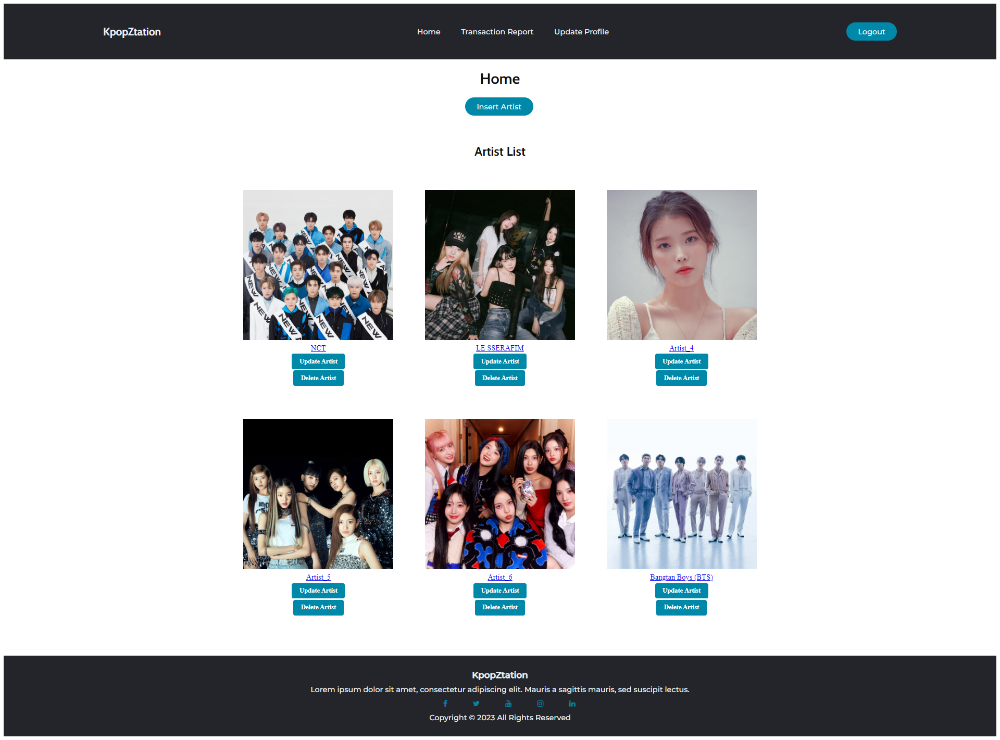

## About
Kpop-Ztation is a website where users can look and buy for their favorite Kpop albums. This project was a lab project for the subject "Pattern Software Design" where we were tasked to create a website using the MVC design pattern. The website is made to be user-friendly and easy to navigate.
#
Languages used :
- Frontend: 
  - ASP.net
  - CSS
- Backend:
  - Logic: C#
  - Database: SQL
#
*Contributors of this project:*
- 2501970310 - Raphael William Theodore Tumewu (Frontend & Backend Logic)
- 2501968943 - Jonathan Emmanuel (Backend Logic & Documentation)
- 2501962422 - Nicholas Vincent Leandro (Reporting logic)

#
*Screenshots:*

Login:

Update Profile:

Home page (admin view):

Transaction report (admin view):

Artist detail (user view):
