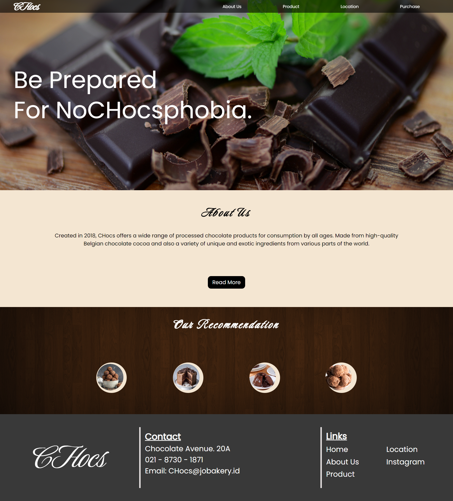
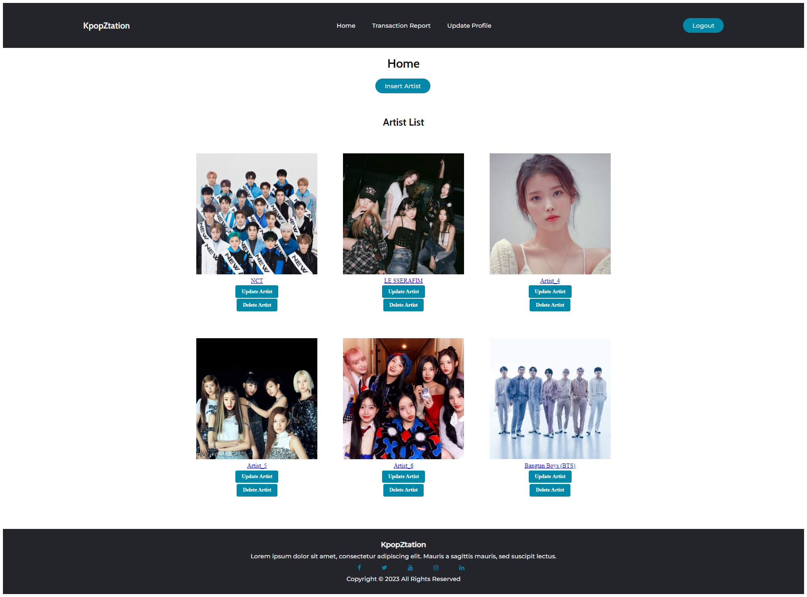

## Projects

### Project 1: [Password Manager](./PasswordManager/)

**Description:** 
This project was a final assignment for Object-Oriented Programming built using Java and its built-in libraries that are made use for its safe-keeping features and encryption of users' passwords. With this project, the aims is to understand the principles of Object-Oriented Programming and how it can be applied to real-life problems.

**Language used:** Java

### Project 2: [CHocs](./CHocs/)

**Description:** This project was made using HTML, CSS, and JavaScript. This was a project in our lab class by the subject "Human and Computer Interaction" where we were tasked to create a website for users as a customer to be able to order chocolates online. The website is made to be user-friendly and easy to navigate.

**Languages used:** HTML, CSS, JavaScript

**Screenshot:** 

### Project 3: [Kpop-Ztation](./KpopZtation/)

This project is a website where users can look and buy for their favorite Kpop albums. This project was a lab project for the subject "Pattern Software Design" where we were tasked to create a website using the MVC design pattern. The website is made to be user-friendly and easy to navigate.

**Screenshot:** 

**Languages used:**
- Frontend: 
  - ASP.net
  - CSS
- Backend: 
  - Logic: C#
  - Database: SQL
